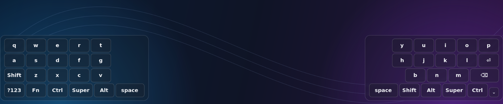
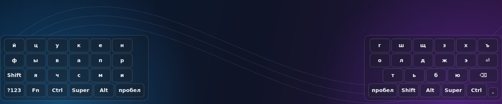
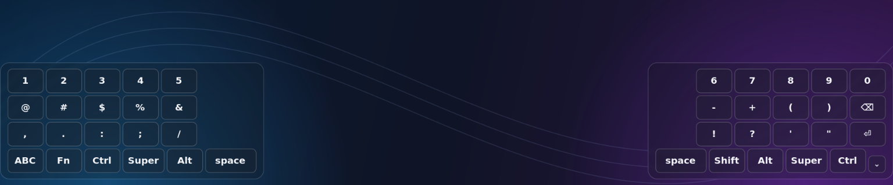
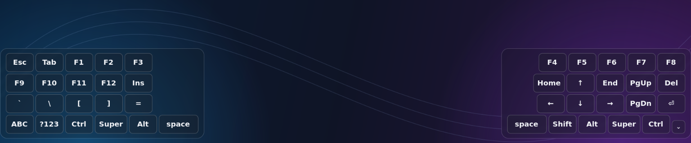

# waylandkb

`waylandkb` is a Rust on-screen keyboard prototype for Wayland. It renders two
independent translucent layer-shell panels at the bottom-left and bottom-right
screen edges, leaving the middle of the screen unobstructed.



## Screenshots

Russian layout:



Numbers and symbols:



Function keys and navigation:



These screenshots show the actual GTK keyboard over a generated background.
Transparency and blur depend on compositor support; the panels sit at the
screen edges, with the centre left free for the application.

## Requirements

- Rust 1.96 or newer
- GTK4 development libraries
- A Wayland compositor with `gtk4-layer-shell` and
  `zwp_virtual_keyboard_v1` support
- Write access to `/dev/uinput` for system shortcuts (see below)

Clone the project with:

```sh
git clone https://github.com/acup1/waylandkb.git
cd waylandkb
```

On NixOS, enter the development shell first:

```sh
nix develop
```

If flakes are disabled, use:

```sh
nix-shell
```

## Run

```sh
cargo run -- --always-visible
```

The labels follow the active system layout automatically. The runtime selects
the matching source from the session environment: driftwm state, Niri,
Hyprland, Sway, KDE Plasma, GNOME, IBus, Fcitx5, or X11 (`xkb-switch`). It does
not require a compositor option. For an otherwise unsupported environment,
`WAYLANDKB_LAYOUT_FILE` may point to a text file containing `us`, `en`, or `ru`;
changes to that file are detected while the keyboard is running.
Text is sent through the native Wayland virtual-keyboard protocol to the
application that already has keyboard focus; the keyboard surfaces do not take
keyboard focus themselves.

Tap `Ctrl`, `Super`, `Alt`, and `Shift` to apply them to the next key, or hold
them while pressing other keys. Several modifiers can be combined. Double-tap `Shift`
to lock uppercase input (`Caps`); tap it once more to unlock. Hold a character,
space, or Backspace to repeat it. `?123` opens the compact number and symbol
page; `Fn` opens Esc, Tab, F1–F12, arrows and navigation keys;
`ABC`/`АБВ` returns to letters. Modifiers remain selected across page changes.
Use the small down-arrow button in the
bottom-right corner to dismiss both halves.

## System tray

The keyboard keeps a tray icon while its panels are hidden. Click the icon to
show/hide both halves; its context menu offers **Показать клавиатуру**,
**Скрыть клавиатуру**, and **Выход**. The down-arrow button and window close
requests hide the keyboard without exiting. Launching it again shows the
existing keyboard. Automatic input detection continues while it is hidden.

The tray uses the session D-Bus StatusNotifierItem/DBusMenu interfaces, without
AppIndicator/GTK3 dependencies or compositor-specific configuration. A panel
with StatusNotifier support is required. The icon is re-registered when the
tray host starts or restarts. Without a compatible tray, automatic visibility
and the control socket still work; a warning is printed.

The tray artwork is built into the binary and provided at 16, 22, 24, 32, 48,
and 64 pixels; it does not depend on the installed icon theme. Edit
`assets/waylandkb.svg` and regenerate the embedded PNG before rebuilding:

```sh
nix-shell -p librsvg --run 'rsvg-convert --width 128 --height 128 --output assets/waylandkb.png assets/waylandkb.svg'
```

## System shortcuts

Shortcuts containing Ctrl, Alt or Super, and function/navigation keys, use one
persistent Linux uinput keyboard. They pass through the same input processing
as a physical keyboard, including system XKB actions such as Super+Space.
There is no whitelist of particular combinations. Key positions are physical
(Russian `с` is the C key); layout-dependent shortcut behavior is controlled
by the compositor/application, just as with a physical keyboard.
Ordinary text and symbols still use the Wayland keymap for English/Russian.

At startup, `shortcuts: using /dev/uinput` confirms that the system input path
is available. If it is not, a warning is printed and Wayland is used as a
fallback. That fallback **cannot guarantee compositor shortcuts or system
layout switching**. Do not run the whole GTK application as root or make
`/dev/uinput` world-writable.

On NixOS, if access is not already configured, import `config/uinput.nix` into
your system configuration and rebuild. It loads uinput and grants access to
the active local session using udev/logind. This permission allows processes
running as that user to synthesize keyboard/mouse input; enable it only for
trusted local sessions. No compositor-specific command is needed.

Without `--always-visible`, the keyboard starts hidden and listens on
`/tmp/waylandkb.sock`:

```sh
printf show | nc -U /tmp/waylandkb.sock
printf hide | nc -U /tmp/waylandkb.sock
printf toggle | nc -U /tmp/waylandkb.sock
```

The keyboard automatically appears for focused text inputs using two independent
sources: Wayland `zwp_input_method_v2` and desktop accessibility (AT-SPI). The
latter also covers browsers and applications whose input method bypasses
Wayland text-input (for example, GTK/IBus). The monitor requests accessibility
through `org.a11y.Status.IsEnabled`; it does not enable screen-reader mode and
never requests field contents, passwords, selections or terminal output.

Editable accessibility widgets and terminal roles trigger the keyboard.
For GPU terminals that expose a generic panel instead of a terminal role,
focused canvases are recognized using the application's installed
`TerminalEmulator` desktop category. Terminal window activation is a fallback
when a custom GL canvas does not publish widget-focus events at all; subsequent
toolbar focus can hide it again. Other applications are not classified as text
inputs merely because their windows are active. If an application exports neither text-input
nor usable accessibility metadata, the control socket is still available.

Sources are combined and hiding is briefly debounced, so a Wayland deactivation
does not override a field still detected through accessibility. Use
`--debug-visibility` to log source transitions without logging input contents.
Detection lives in `src/input_method.rs` and `src/accessibility.rs`; source
coordination in `src/visibility.rs`; manual control in `src/control.rs`.

## Background blur

The app requests blur directly through the standard staging
`ext_background_effect_v1` protocol and keeps its GTK surfaces translucent. On
compositors that do not implement the protocol, a compositor rule can provide
the same effect. For Hyprland, include the supplied blur and alpha-clipping
rules:

```ini
source = /path/to/waylandkb/config/hyprland.conf
```

Run with a custom namespace if your compositor rules need it:

```sh
cargo run -- --always-visible --namespace waylandkb
```

The keyboard's scoped CSS takes precedence over user-installed GTK themes that
would otherwise paint an opaque window background. Blur and pointer regions
follow the rounded panel geometry and are updated after resize and remapping;
the transparent corners are not blurred. GTK remains responsible for surface
commits. Protocol capability checking reports unsupported blur instead of
silently claiming it is active.

## Tests

```sh
cargo test
cargo clippy --all-targets -- -D warnings
```

An opt-in desktop integration test drives the UI's key gesture handlers and
checks actual GTK shortcut activation, system layout switching and Cyrillic
input. It opens a dedicated receiving window and refuses to send input if
that window is not active. It requires `/dev/uinput`, readable system layout
state, and Super+Space configured to switch between two layouts. It switches
back to the original layout after checking the change. Do not interact with
other windows while it runs.

```sh
WAYLANDKB_LIVE_TEST=1 GDK_BACKEND=wayland cargo test desktop_shortcuts_from_ui -- --ignored --nocapture --test-threads=1
```

The visual test briefly displays a generated checkerboard and real layer-shell
keyboard, checks alpha values under the installed GTK theme, and saves a cropped
blur screenshot to `/tmp/waylandkb-blur-test.png` when `grim` is installed:

```sh
WAYLANDKB_LIVE_TEST=1 GDK_BACKEND=wayland cargo test desktop_keyboard_background -- --ignored --nocapture --test-threads=1
```

To regenerate the README screenshots, install `grim` and run the dedicated
opt-in capture test. It briefly displays a generated backdrop behind the real
keyboard and saves only that region to `docs/images/`. It does not type text
or change the system layout. Close any other running copy of the keyboard
before capturing, and avoid interacting with the desktop during the capture.

```sh
WAYLANDKB_LIVE_TEST=1 GDK_BACKEND=wayland cargo test desktop_readme_screenshots -- --ignored --nocapture --test-threads=1
```
